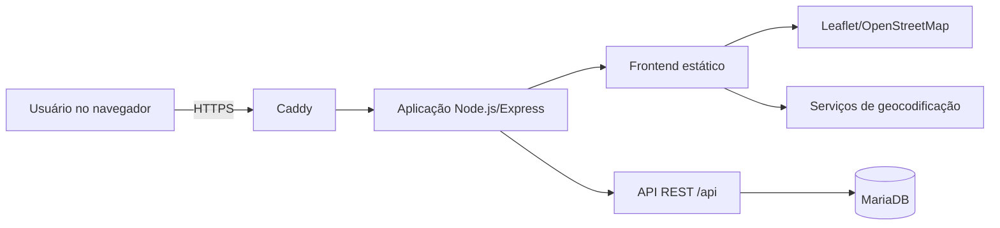
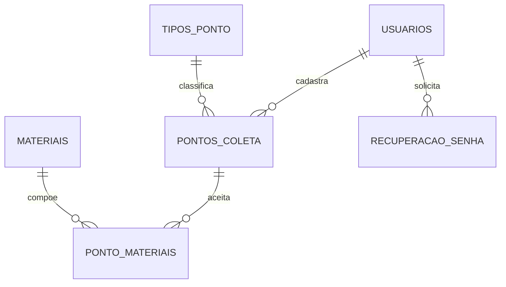

# Documentação Técnica — E-Lixo Consciente

## 1. Visão geral

O E-Lixo Consciente é uma aplicação web colaborativa para cadastro, validação e consulta de pontos de coleta de resíduos eletrônicos. A solução permite que cidadãos encontrem locais adequados para descarte e contribuam sugerindo novos pontos. Sugestões de usuários comuns passam por análise administrativa antes de se tornarem públicas.

O projeto foi desenvolvido por alunos do curso de Tecnologia em Análise e Desenvolvimento de Sistemas da UNINTER:

- Andrey Gabriel Custódio da Silva
- Christian Netto
- Kauã Dias Martins

## 2. Objetivos técnicos

- Disponibilizar uma interface responsiva e de fácil utilização.
- Consultar pontos por nome, rua, bairro, cidade, estado ou CEP.
- Ordenar pontos por proximidade de uma localização pesquisada ou atual.
- Manter um fluxo de moderação para proteger a qualidade das informações.
- Armazenar usuários, pontos, materiais e solicitações em banco relacional.
- Separar permissões de usuário comum e administrador.
- Permitir implantação reproduzível com Docker.

## 3. Tecnologias

| Camada | Tecnologias |
|---|---|
| Interface | HTML5, CSS3 e JavaScript |
| Mapa | Leaflet e OpenStreetMap |
| Geocodificação | Nominatim/OpenStreetMap e serviços de CEP |
| API | Node.js 22 e Express 5 |
| Autenticação | JSON Web Token e bcrypt |
| Banco | MariaDB 11, compatível com MySQL |
| Infraestrutura | Docker, Docker Compose e Caddy |
| HTTPS | Certificados automáticos gerenciados pelo Caddy |

## 4. URLs públicas

As páginas utilizam endereços amigáveis, como `/login`, `/mapa`, `/meus-pontos` e `/painel-admin`. Endereços antigos terminados em `.html` são redirecionados permanentemente para manter a compatibilidade.

## 5. Arquitetura



Em produção, apenas as portas 80 e 443 são publicadas. Aplicação e banco comunicam-se por uma rede Docker interna, e o MariaDB não possui porta pública.

## 6. Organização do repositório

```text
backend/                    API, regras de negócio, autenticação e testes
database/                   schema, seed e migrações
deploy/                     proxy HTTPS e instruções para VPS
docs/                       documentação do projeto
frontend/                   páginas, estilos e scripts do navegador
docker-compose.prod.yml     composição de produção
docker-compose.yml          banco para desenvolvimento local
Dockerfile                  imagem da aplicação
```

## 7. Perfis e regras de negócio

### Visitante

- Acessa páginas institucionais.
- Consulta somente pontos aprovados.
- Pesquisa locais e abre rotas no mapa.
- Pode criar uma conta e autenticar-se.

### Usuário autenticado

- Atualiza dados pessoais e senha.
- Sugere pontos de coleta.
- Acompanha pontos pendentes, aprovados e rejeitados.
- Solicita exclusão de pontos que cadastrou, informando o motivo.
- Não publica diretamente: novos pontos recebem status `PENDENTE`.

### Administrador

- Visualiza resumo e lista completa de cadastros.
- Aprova ou rejeita pontos, registrando motivo de rejeição.
- Analisa solicitações de exclusão.
- Atualiza ou exclui pontos.
- Cadastra pontos já aprovados, sem moderação adicional.
- Lista usuários, gerencia perfis administrativos e ativa ou inativa contas por rota protegida.
- Não pode rebaixar nem inativar a própria conta ou remover o último administrador ativo.

## 8. Cadastro de ponto

São obrigatórios: nome, tipo, CEP, rua, número, bairro, cidade, estado, telefone, horário de funcionamento e ao menos um material aceito. O nome é normalizado para letras maiúsculas. Coordenadas, descrição, site e observações complementam o cadastro.

Os horários são coletados por seleção estruturada de dias e faixas de funcionamento no frontend, reduzindo preenchimentos incompletos. O backend também rejeita telefone, horário ou materiais ausentes.

## 9. Banco de dados

### Entidades

| Tabela | Responsabilidade |
|---|---|
| `usuarios` | Conta, endereço, perfil, status de acesso e senha criptografada |
| `tipos_ponto` | Classificação dos locais de coleta |
| `materiais` | Categorias de resíduos aceitos |
| `pontos_coleta` | Dados, localização, contato, status e auditoria do ponto |
| `ponto_materiais` | Relação muitos-para-muitos entre pontos e materiais |
| `recuperacao_senha` | Tokens de uso único e expiração para redefinição |

### Relacionamentos



Os status de ponto são `PENDENTE`, `APROVADO` e `REJEITADO`. A solicitação de exclusão possui os estados `NENHUMA` e `PENDENTE`.

## 10. API

Todas as rotas utilizam o prefixo `/api`.

### Autenticação e perfil

| Método | Rota | Acesso | Função |
|---|---|---|---|
| POST | `/auth/register` | Público | Criar conta |
| POST | `/auth/login` | Público | Autenticar |
| GET | `/auth/me` | Autenticado | Consultar perfil |
| PUT | `/auth/me` | Autenticado | Atualizar perfil |
| PUT | `/auth/me/senha` | Autenticado | Alterar senha |
| POST | `/auth/esqueci-senha` | Público | Gerar recuperação |
| POST | `/auth/redefinir-senha` | Público | Redefinir senha |

### Pontos e catálogos

| Método | Rota | Acesso | Função |
|---|---|---|---|
| GET | `/pontos` | Público | Listar aprovados |
| GET | `/pontos/:id` | Público | Consultar aprovado |
| GET | `/pontos/meus` | Autenticado | Listar pontos do usuário |
| POST | `/pontos` | Autenticado | Cadastrar ponto |
| POST | `/pontos/:id/solicitar-exclusao` | Autor | Solicitar exclusão |
| GET | `/materiais` | Público | Listar materiais |
| GET | `/tipos-ponto` | Público | Listar tipos de ponto |

### Administração

| Método | Rota | Função |
|---|---|---|
| GET | `/admin/resumo` | Totais administrativos |
| GET | `/admin/pontos` | Listar todos os pontos |
| GET | `/admin/pontos/:id` | Consultar detalhes |
| PUT | `/admin/pontos/:id/aprovar` | Aprovar ponto |
| PUT | `/admin/pontos/:id/rejeitar` | Rejeitar ponto |
| PUT | `/admin/pontos/:id/exclusao/aprovar` | Aprovar exclusão |
| PUT | `/admin/pontos/:id/exclusao/rejeitar` | Rejeitar exclusão |

As rotas administrativas exigem JWT válido e perfil `ADMIN`.

### Gestão de usuários

| Método | Rota | Função |
|---|---|---|
| GET | `/usuarios` | Listar usuários sem retornar senhas |
| GET | `/usuarios/:id` | Consultar um usuário |
| PATCH | `/usuarios/:id/perfil` | Promover ou rebaixar perfil com proteção do próprio acesso e do último administrador |
| PATCH | `/usuarios/:id/status` | Inativar ou reativar a conta sem apagar o histórico |

## 11. Segurança

- Senhas armazenadas com hash bcrypt.
- JWT com segredo obrigatório e mínimo de 32 caracteres em produção.
- Limitação de tentativas nas rotas de autenticação e recuperação.
- Verificação de perfil nas rotas administrativas.
- Verificação do status da conta em toda requisição autenticada, invalidando imediatamente sessões de contas inativadas.
- Restrição de origens HTTP por `CORS_ORIGIN`.
- Corpo JSON limitado a 100 KB.
- Cabeçalhos `nosniff`, bloqueio de iframe e política de referência.
- HTTPS e HSTS no proxy de produção.
- MariaDB sem exposição pública.
- Arquivos `.env`, backups e dependências ignorados pelo Git e Docker.

### Limitação conhecida

O token de sessão permanece no `localStorage`. Para um serviço de maior risco, recomenda-se migrar a autenticação para cookie `HttpOnly`, `Secure` e `SameSite`, com proteção CSRF. A recuperação gera tokens válidos, mas o envio real por e-mail ainda precisa de integração com um provedor transacional.

## 12. Execução local

```bash
docker compose --env-file .env up -d
cd backend
npm ci
npm start
```

Acesse `http://localhost:3001` e valide a saúde em `http://localhost:3001/api/health`.

## 13. Produção

Copie `.env.production.example` para `.env.production`, preencha valores seguros e execute:

```bash
docker compose --env-file .env.production -f docker-compose.prod.yml up -d --build
```

As orientações completas estão em [`deploy/README.md`](../deploy/README.md).

## 14. Verificação

```bash
cd backend
npm run check
npm test
npm run smoke
npm run smoke:ui
```

Na revisão de 5 de agosto de 2026, 27 arquivos JavaScript foram validados, os testes unitários, de API e de interface passaram, e o `npm audit` não encontrou vulnerabilidades conhecidas nas dependências de produção.

## 15. Evoluções sugeridas

- Integração com serviço de e-mail transacional.
- Ampliar os testes de integração e ponta a ponta para mais navegadores.
- Auditoria administrativa detalhada.
- Paginação no backend para grande volume de pontos.
- Monitoramento, alertas e backup externo automatizado.
- Migração da sessão para cookies seguros.
